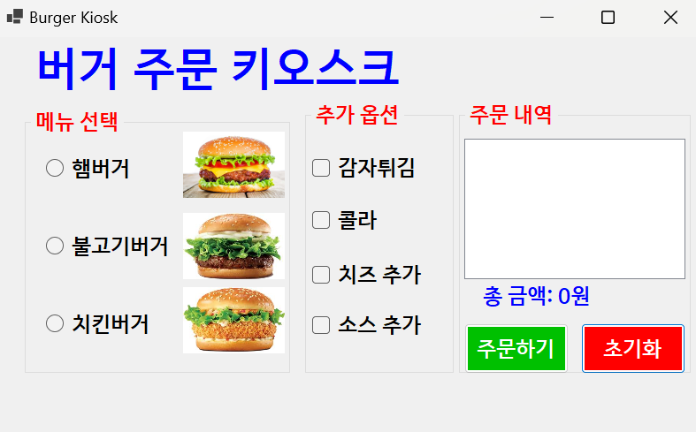
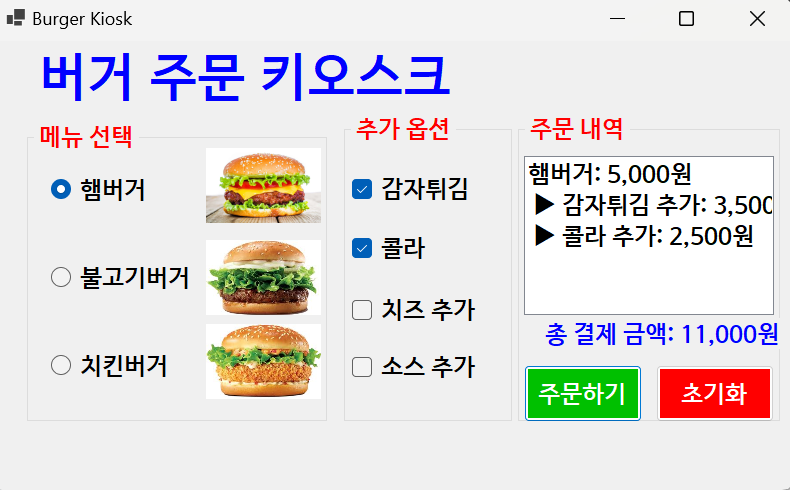
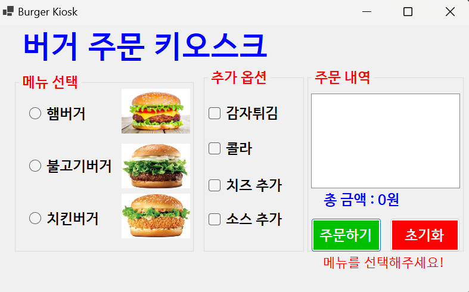
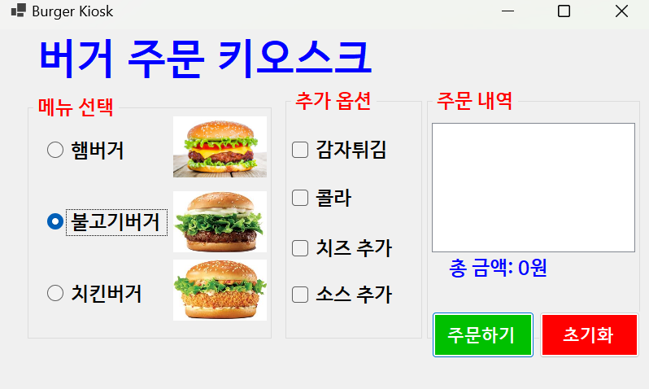
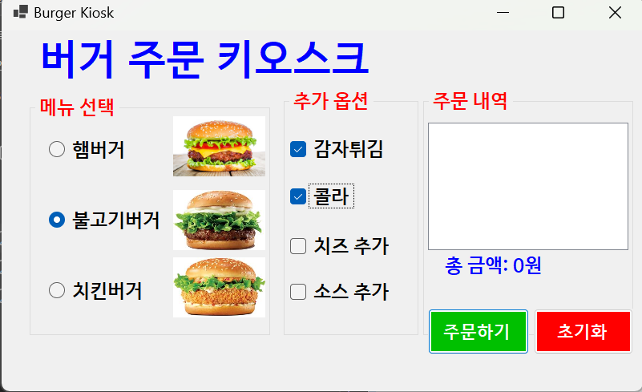
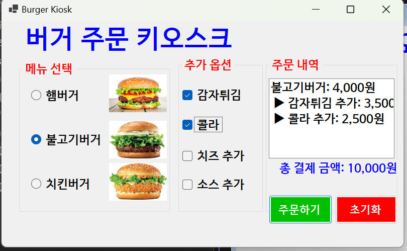
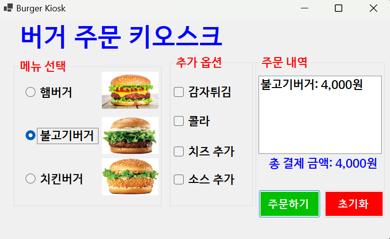
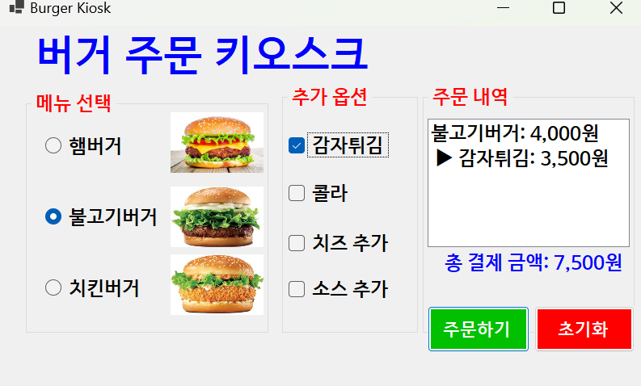
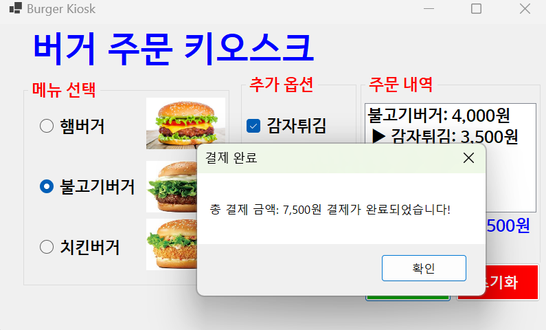

# BurgerKiosk

# (C# 코딩) BurgerKiosk

## 개요
-C# 프로그래밍 

### -1줄소개: 사용자 친화적인 UI와 실시간 금액 계산 기능을 갖춘 윈도우 폼 기반 햄버거 키오스크 프로그램

### -사용한플랫폼: C#, .NET Windows Forms, Visual Studio, GitHub

### -사용한컨트롤:

 - 입력: RadioButton(메뉴 선택), CheckBox(추가 옵션 선택), Button(주문/초기화)

 - 출력: ListBox(주문 내역 표시), Label(합계 금액 및 에러 메시지 표시)

 - 컨테이너: GroupBox(메뉴 및 옵션 그룹화), PicterBox(사진 표시)

### -사용한기술과구현한기능: 

 - if-else if 문을 활용한 단일 메뉴 선택 로직

 - 개별 if 문을 활용한 다중 옵션 중복 선택 및 금액 누적

 - bool 플래그 변수를 이용한 이벤트 제어 및 버그 수정

 - UpdateOrder() 공통 함수를 통한 코드 재사용성 향상

 - Visible 속성 제어를 통한 동적 에러 메시지 라벨 구현

 
### -수업중에배우고사용했던클래스들관련된설명
 
- Form 클래스: Windows 창을 생성하고 관리하는 기본 클래스

 - Control 클래스: 버튼, 라디오버튼 등 UI 요소들의 최상위 클래스로, Visible, Enabled, Text 등의 속성을 공통으로 사용함

 - MessageBox 클래스: 사용자에게 중요한 알림이나 결과를 팝업 창으로 보여줌

 - Listbox.ObjectCollection: 리스트박스에 항목을 추가(Add)하거나 초기화(Clear)할 때 사용함

### -실습중에구현한기능들설명

 - 주문 처리: 선택한 항목의 가격을 합산하여 총액을 산출하고 내역을 리스트박스에 출력

 - 초기화: 모든 선택 사항을 해제하고 금액과 리스트박스를 처음 상태로 복구

 - 예외 처리: 필수 항목(메뉴) 미선택 시 경고 라벨 표시 및 로직 차단

 - 실시간 업데이트: 버튼 클릭 없이 항목 선택 즉시 결과가 반영되는 동적 UI

## 실행화면(과제1)

### -과제1코드의실행스크린샷
 

### -과제내용

1.  라디오 버튼을 이용한 버거 메뉴 선택 기능 구현

2.  체크박스를 이용한 사이드 메뉴 다중 선택 기능 구현

3.  주문하기 버튼 클릭 시 리스트박스에 상세 내역 출력

4.  초기화 버튼 클릭 시 모든 입력 값 초기 상태 설정

### -구현내용과기능설명

1.  totalCost 변수를 선언하여 선택된 항목의 가격을 누적 계산

2.  RadioButton.Checked 속성으로 단일 선택된 메뉴 식별

3.  CheckBox.Checked 속성으로 다중 선택된 모든 옵션 합산

4.  lstOrderbox.Items.Add()를 통해 주문 내역 시각화

### -사용한 기술과 구현한 기능
 - 변수 초기화 및 산술 연산

 - ToString("N0")을 활용한 금액 천 단위 콤마 표시

## -실행화면(과제2)

### -과제2코드의실행스크린샷

### -과제내용

1.  메뉴 미선택 시 주문 방지 로직 구현

2.  예외 상황 발생 시 사용자에게 경고 메시지 전달

3.  팝업창(MessageBox) 대신 화면 내 라벨을 이용한 알림 방식 적용

4.  정상 주문 시 경고 메시지 자동 소거 기능

### -구현내용과기능설명

1. if 문과 논리 연산자(&&, !)를 활용하여 버거 선택 여부 검사
2. 조건 만족 시 return 키워드로 함수 실행을 중단하여 잘못된 주문 방지
3.  에러 라벨의 Visible 속성을 true/false로 실시간 제어
4.  초기화 버튼 클릭 시에도 에러 메시지가 사라지도록 설정
 
### -사용한 기술과 구현한 기능

 - 유효성 검사 (Validation)

 - UI 컨트롤의 가시성(Visibility) 제어

## -실행화면(과제3)
### -과제3코드의실행스크린샷

### -과제내용

1.  Tab 키를 이용한 컨트롤 간 포커스 이동 순서 최적화

2.  불필요한 컨트롤의 탭 포커스 제외 처리

3.  Enter 키와 Esc 키를 이용한 주문 및 초기화 단축키 설정

4.  접근성 및 사용자 경험(UX) 개선

### -구현내용과기능설명

1.  TabIndex 속성을 번호순으로 부여하여 논리적인 이동 경로 생성

2.  라벨 등 입력 불필요 항목의 TabStop 속성을 False로 설정

3.  폼의 AcceptButton 속성에 btnOrder 연결

4. 폼의 CancelButton 속성에 btnReset 연결

### -사용한 기술과 구현한 기능

 - 컨트롤 포커스 제어 및 Tab 순서 최적화

 - 폼 레벨의 키보드 이벤트 매핑

## -실행화면(과제4)

### -과제4코드의실행스크린샷

### -과제내용

1.  항목 선택 변경 시 즉시 금액이 갱신되는 실시간 시스템 구현

2.  코드 중복을 최소화하기 위한 공통 함수 추출

3.  초기화 시 발생하는 이벤트 충돌 버그 수정

4.  결제 완료 메시지 추가

### -구현내용과기능설명

1.  주문 로직을 UpdateOrder()라는 별도 메소드로 분리하여 재사용

2.  모든 라디오 버튼과 체크박스의 CheckedChanged 이벤트를 공통 함수에 연결

3.  bool isResetting 플래그 변수를 사용하여 리셋 중 불필요한 이벤트 발생 차단

4.  주문 버튼은 최종 결제 확인 및 완료 팝업 호출 역할로 변경

### -사용한 기술과 구현한 기능

 - 공통 메소드 추출 (Code Refactoring)

 - 불리언(Boolean) 변수를 이용한 상태 제어 (Flag 로직)

 - 멀티 캐스트 델리게이트(이벤트 공유) 활용